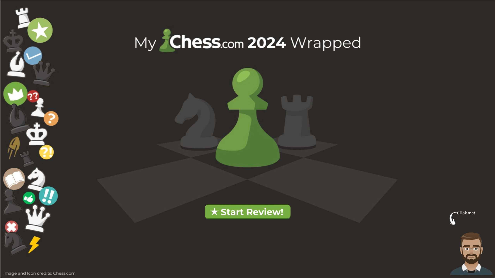

# Chess.com 2024 Journey Dashboard  

## Overview  
This project is a personal exploration of my Chess.com games played throughout 2024. Using interactive dashboards, I analyzed my performance, strategies, and milestones across different chess metrics. The project serves as both a reflection on my journey and a data visualization exercise.  

## Key Features  
- **Performance Analysis by Piece**  
  - *Pawn*: Elo progression over time, game types played, and wins against stronger opponents.  
  - *Knight*: Game patterns by week, longest win streak, and opponent ratings analysis.  
  - *Bishop*: Insights into performance against opponent Elo bins, game length by result, and opening moves analysis.  
  - *Rook*: Breakdown of wins, draws, and losses by reason; gameplay strategies as White and Black.  
  - *Queen*: Focus on the most common openings and their respective performances.  
  - *King*: Overall year summary, top openings, and win/loss trends.  

## Tools and Technologies  
- **Data Source**: Exported game data from Chess.com.  
- **Visualization**: Tableau for interactive dashboards.  
- **Development Tools**: Python for data preprocessing and GitHub for project management.  

## Dashboard Previews  
### Snapshot  
  

> *Above: A preview of the interactive Tableau dashboard used in this project.*  

### 1. **King Dashboard**  
Highlights top performances, preferred openings, and overall trends.  

### 2. **Pawn Dashboard**  
Shows Elo progression, game types played, and wins against stronger players.  

### 3. **Knight Dashboard**  
Weekly activity trends, longest win streaks, and opponent rating distributions.  

### 4. **Bishop Dashboard**  
Analysis of performance by Elo bins, game length by result, and opening repertoire.  

### 5. **Rook Dashboard**  
Game results categorized by reason (wins, draws, losses) and gameplay as White/Black.  

### 6. **Queen Dashboard**  
Focus on the most common openings and their impact on game outcomes.  

## How to Access the Dashboard  
You can explore the interactive dashboards here: [Insert Dashboard Link]  

## Feedback  
I welcome your feedback to improve this project. Please feel free to reach out with your thoughts or suggestions!  

## Future Work  
- Adding more advanced metrics such as tactics training progress and time management.  
- Exploring deeper insights into midgame and endgame performance.  
- Integrating data from other chess platforms for comparison.  

## Acknowledgments  
Thanks to Chess.com for providing game data and to the Tableau and GitHub communities for their support in developing this project.  
